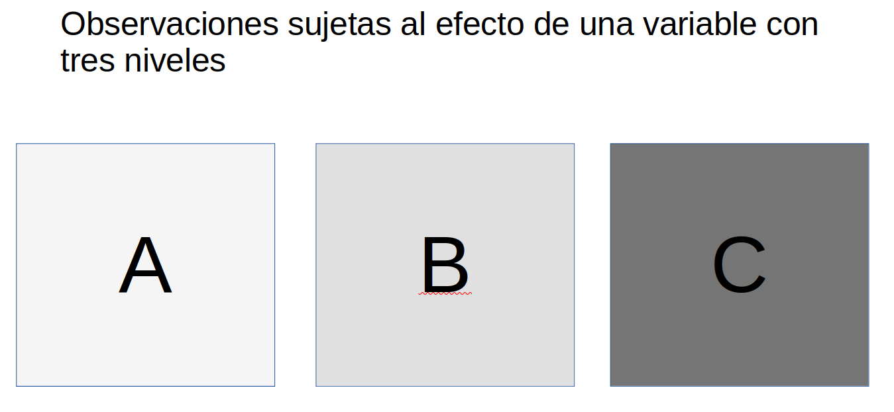
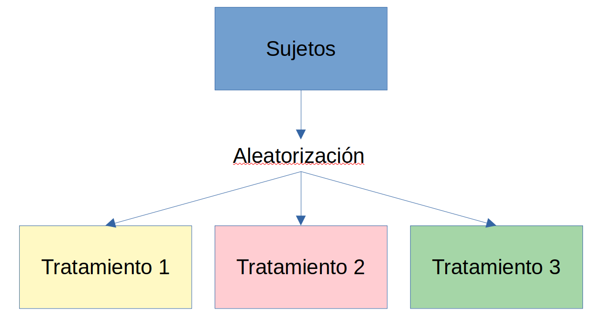
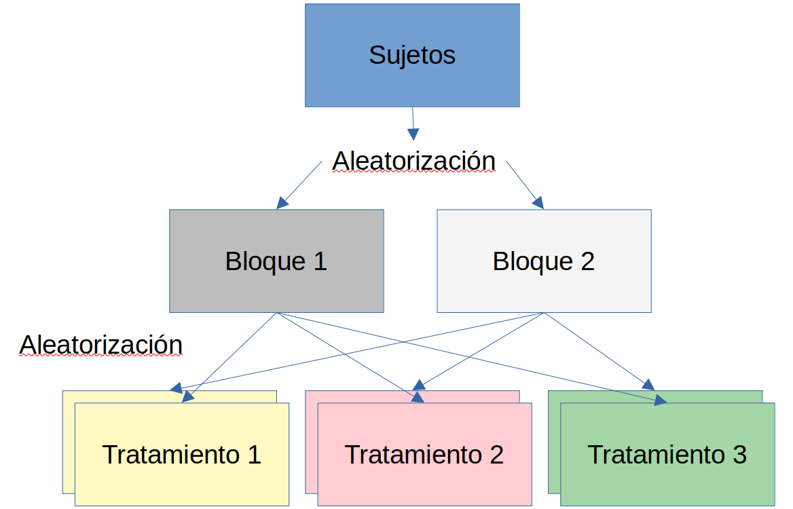
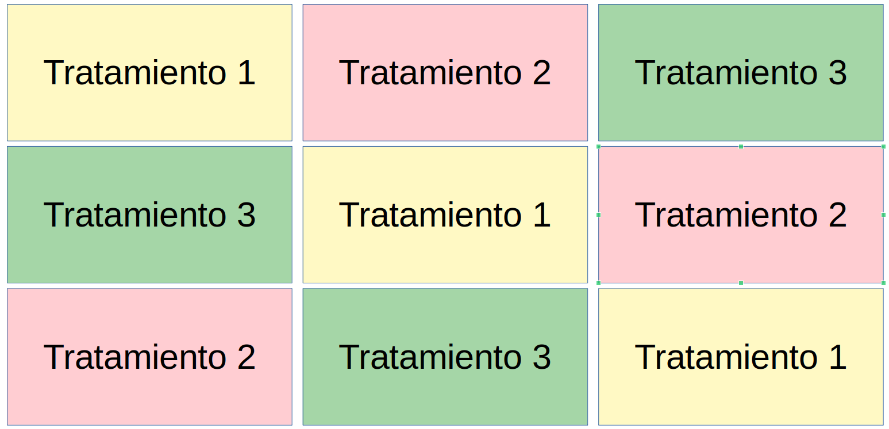
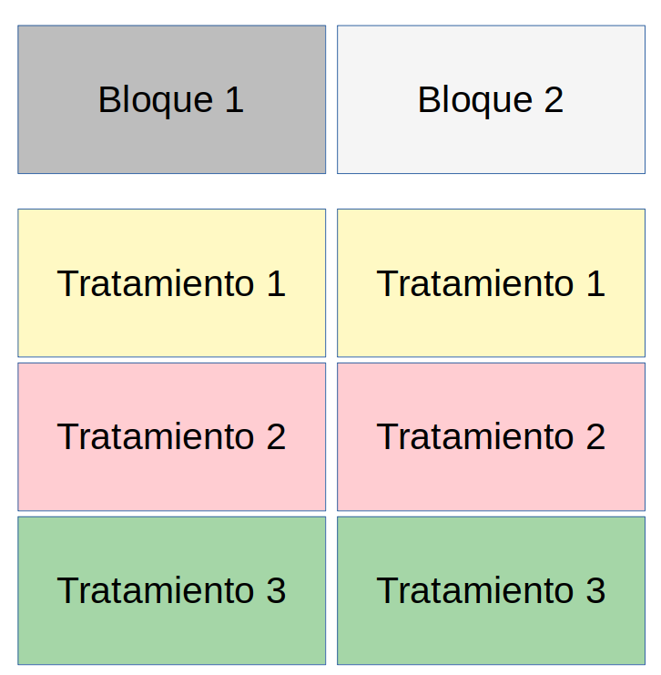
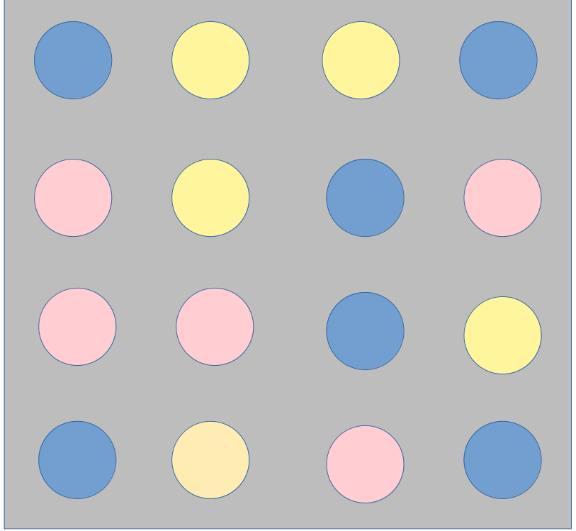
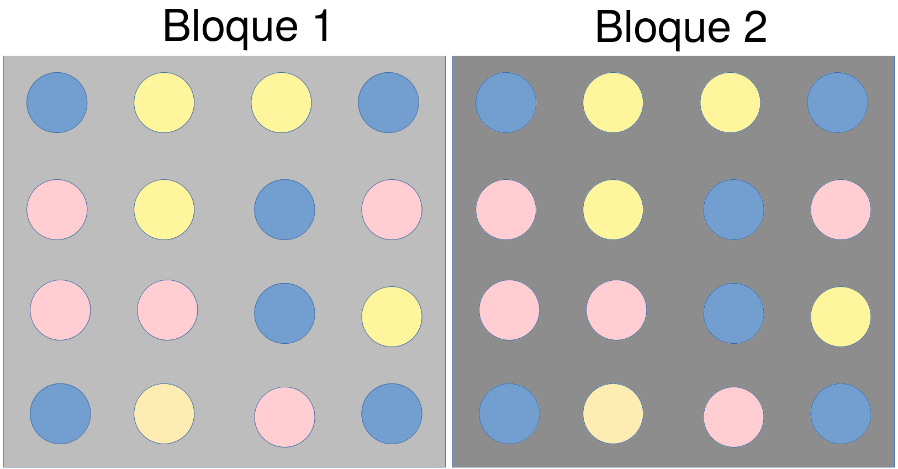

```{r setup, include=FALSE}
knitr::opts_chunk$set(dev = 'pdf')
```

# Tipos de estudios

### Grado de control

Control de tratamientos (variables independientes, contínuas ó categóricas)

1. Experimentales
2. Observacionales
3. Híbridos

### Características de las observaciones

Tiempo de exposición de las unidades experimentales a los tratamientos

1. Factorial
2. Cohorte

# Experimentales

### Características

1. Se controlan las variables independientes (tratamientos)
2. Más de una variables independiente ó variable con más de dos niveles

### Ejemplo

Leer resumen de:

[Influencia de tres regímenes de riego](https://www.scielo.org.mx/scielo.php?script=sci_arttext&pid=S0187-57792022000100110&lang=es)

# Observacionales

### Características

1. No hay control sobre variables independientes
2. Más de una variable categórica ó contínua

    - Podría ser necesario reducir dimensiones con PCA
    
### Ejemplos

Leer resumen de:

[Efecto de la altitud, pendiente y exposición ...](https://www.scielo.org.mx/scielo.php?script=sci_arttext&pid=S0187-71512022000100111&lang=es)

# Híbridos

### Características

1. Control de algunos tratamientos o efectos
2. Más de una variable contínua ó categórica

### Ejemplos 

Leer resumen de:

[Are dingoes a trophic regulator in arid Australia?](https://onlinelibrary.wiley.com/doi/abs/10.1111/j.1442-9993.2009.02022.x?casa_token=6OoxIR1B-QoAAAAA%3AwZbzD6pSefvllxeQeLDvjwrThwrx5kij_Y3-OiEGe-a3_fsrEbAV4nwY_qa6PKB8QJpk4om9c5cMWmcH)

# Clasificación por tiempo de exposición

### Factoriales



### Ejemplo

Efecto del tipo de suelo sobre tiempo de germinación de semillas de palma:

- Suelo A - promedio de germinación 2 semanas
- Suelo B - promedio de germinación 2.2 semanas
- Suelo C - promedio de germinación 1.78 semanas

### Cohorte

Se sigue por un largo período de tiempo a lxs individuos participantes y registran eventos clave, objeto de estudio

### Ejemplo

En el experimento de germinación, se puede registrar

1. Fecha de inicio de experimento
2. Fecha de germinación
3. Fecha en que ocurrió primera floración
4. Fecha en que se detectó crecimiento de frutos
5. Número de frutos producidos
6. Número de descendientes en primera floración

# Logística de los experimentos

### Características de diseños experimentales

Cómo se asignan las unidades experimentales a los tratamientos

1. Aleatorizados

2. Replicados

### Aleatorizados

- Muestras seleccionadas al asar

- Unidades experimentales asignadas al asar

- Ubicación de unidades es aleatoria

### Réplicas

- Tratamientos experimentales

- Unidades experimentales

- Sitios de muestreo

### Objetivo del diseño

- Repetitividad

    - Que las hipótesis probadas sean predictivas a escalas comparables
    
    - En otros experimentos
    
    - En contextos más amplios que experimentales
    
### Relación entre diseño e hipótesis

- Diseño debe permitir probar hipótesis estadística

- Factorial

    - Factor = variable independiente
    
    - Variables medidas = variable dependiente

### Tipos

1. Completamente aleatorizado

2. Bloques aleatorizados

3. Cuadrado latino

4. Split Plot, o parcelas divididas

5. Rejilla

6. Aumentados

### Aleatorizado



### Bloques aleatorios



### Cuadrado latino



### Split plot



### Rejilla



# Relación entre diseño y análisis

### Tipos de variables observacionales

Numéricas:

    - Regresión lineal
    - ANOVA
    - Modelos lineales generalizados

### Variables contínuas

Positivas ó negativas

    - Regresión lineal
    - ANOVA

Variables independientes contínuas y/o categóricas:

    - Regresión lineal
    
Variables independientes categóricas únicamente:

    - Regreción lineal
    - ANOVA
    
### Variables contínuas

Estrictamente positivas (p. ej. precipitación, tiempo)

    - Modelos lineales generalizados
        - log-normal
        - Gamma (más recomendado para tiempo)
        
### Variables discretas

Variables discretas, sin decimales, p. ej. conteos poblacionales

    - Modelos lineales generalizados
        - Poisson
        - Logística, binomial (también para binarias, 1, 0)
        
# Factores de agrupamiento

### Bloques



### Bloques

- Tratamientos experimentales (Color de las bolitas)

- Agrupamiento: bloques (Cajas de color gris)

- Implicaciones para análisis:

    - Tratamientos: efectos fijos
            - Factores cuyo efecto sobre objeto de estudio deseamos medir
    
    - Bloques: efectos aleatorios
            - Factores no medidos, desconocidos que aumentan variabilidad
            
### Ejemplo del efecto de los bloques

```{r echo = F, fig.height = 4, fig.width=4.5, fig.align='center'}
set.seed(154)

x.b1 <- c(rnorm(10, mean = 5, sd = 1),
          rnorm(10, mean = 6, sd = 0.15),
          rnorm(10, mean = 5.1, sd = 0.7))

x.b2 <- c(rnorm(10, mean = 4, sd = 1.5),
          rnorm(10, mean = 4.7, sd = 0.5),
          rnorm(10, mean = 4.5, sd = 1))

bloque <- rep(c(1, 2), each = 30)

tratamiento <- c(rep(c(1, 2, 3), each = 10),
                 rep(c(1, 2, 3), each = 10))

base <- data.frame(Valor = c(x.b1, x.b2),
                   Bloque = as.factor(bloque),
                   Tratamiento = as.factor(tratamiento))

library(ggplot2)

ggplot(base) + geom_boxplot(aes(x = Tratamiento, y = Valor, fill = Tratamiento))
```

### Ejemplo del efecto de los bloques

```{r echo = F, fig.height=4.5, fig.width=8}
ggplot(base) + geom_boxplot(aes(x = Tratamiento, y = Valor, fill = Tratamiento))+
    facet_wrap(~Bloque)
```

### Efecto de bloques y tratamientos

- Bloques afectan dispersión (varianza)

- Tratamientos afectan promedio
